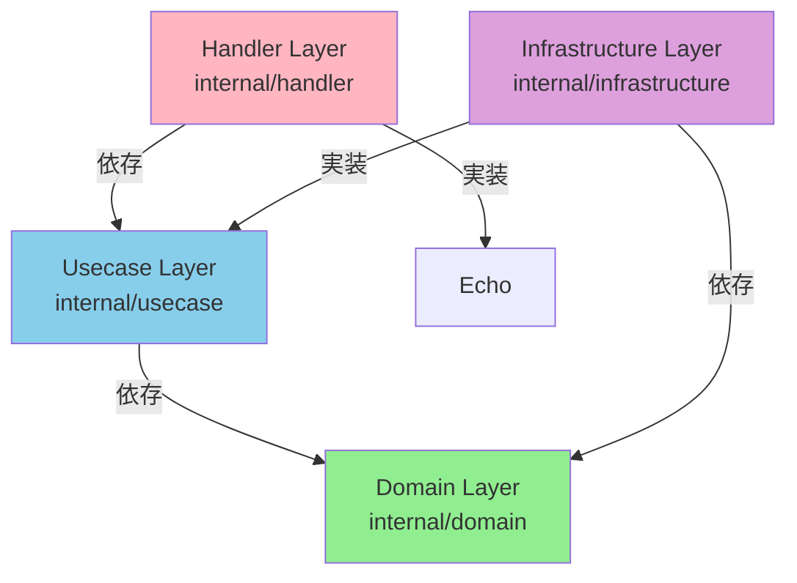

# Echo + Clean Architecture 実装ガイド

このガイドは、Go言語とClean Architectureを学習するための実装手順を説明します。

## 目次
1. [アーキテクチャ概要](#アーキテクチャ概要)
2. [ディレクトリ構成](#ディレクトリ構成)
3. [依存関係の流れ](#依存関係の流れ)
4. [実装ステップ](#実装ステップ)
5. [Echoフレームワークの使い方](#echoフレームワークの使い方)
6. [依存性注入(DI)について](#依存性注入diについて)

## アーキテクチャ概要

このプロジェクトは **Clean Architecture** に基づいて構成されています。Clean Architectureの核心は「依存関係の方向を制御すること」です。

### 依存関係の図



### レイヤーの説明

#### 1. Domain Layer（ドメイン層）
- **場所**: `internal/domain/`
- **役割**: ビジネスロジックの中心。エンティティ、値オブジェクト、ドメインエラーを定義
- **依存**: なし（他のレイヤーに依存しない）
- **ファイル例**:
  - `file_model.go`: Fileエンティティ、FileName値オブジェクト
  - `errors.go`: ドメインエラー定義

#### 2. Usecase Layer（ユースケース層）
- **場所**: `internal/usecase/`
- **役割**: アプリケーションのビジネスルール。ファイルのアップロード、ダウンロードなどの操作を定義
- **依存**: Domain Layerのみ
- **ファイル例**:
  - `file_usecase.go`: FileUsecaseインターフェースと実装

#### 3. Infrastructure Layer（インフラストラクチャ層）
- **場所**: `internal/infrastructure/`
- **役割**: 外部システム（DB、ファイルシステム）とのやり取り
- **依存**: Domain Layer、Usecase Layerのインターフェース
- **ファイル例**:
  - `file_repository.go`: FileRepositoryの実装

#### 4. Handler Layer（ハンドラ層）
- **場所**: `internal/handler/`
- **役割**: HTTPリクエストの受け取りとレスポンスの返却
- **依存**: Usecase Layer
- **ファイル例**:
  - `file_handler.go`: Echoハンドラーの実装

## ディレクトリ構成

```
.
├── cmd
│   └── server
│       └── main.go              # アプリケーションのエントリーポイント
├── internal
│   ├── domain                   # ドメイン層
│   │   ├── file_model.go       # Fileエンティティ、値オブジェクト
│   │   └── errors.go           # ドメインエラー
│   ├── usecase                  # ユースケース層
│   │   └── file_usecase.go     # ビジネスロジック
│   ├── infrastructure           # インフラストラクチャ層
│   │   └── file_repository.go  # データ永続化
│   └── handler                  # ハンドラ層
│       └── file_handler.go     # HTTPハンドラー
└── docs
    └── implementation_guide.md  # このファイル
```

## 依存関係の流れ

Clean Architectureの重要な原則：**内側のレイヤーは外側のレイヤーに依存してはいけない**

### 依存の方向
```
Handler → Usecase → Domain
Infrastructure → Domain
Infrastructure → Usecase (インターフェースを実装)
```

### なぜこの構造？

1. **テストしやすい**: 各レイヤーを独立してテストできる
2. **変更に強い**: DBを変更しても、Domain/Usecaseは変更不要
3. **フレームワーク非依存**: Echoを別のフレームワークに変更しても、内側は影響を受けない

## 実装ステップ

### Step 1: Domain Layer（ドメイン層）の実装

最も内側から始めます。

#### ファイル: `internal/domain/file_model.go`

```go
func NewFileName(raw string) (FileName, error) {
    // TODO: ここに実装
    // 1. 空文字列チェック
    if raw == "" {
        return "", ErrInvalidName
    }
    
    // 2. パストラバーサル対策
    if strings.Contains(raw, "..") {
        return "", ErrInvalidName
    }
    
    // 3. ディレクトリ区切り文字のチェック
    if strings.Contains(raw, "/") || strings.Contains(raw, "\\") {
        return "", ErrInvalidName
    }
    
    return FileName(raw), nil
}
```

#### テストの書き方

```go
// internal/domain/file_model_test.go を作成
package domain

import "testing"

func TestNewFileName(t *testing.T) {
    tests := []struct {
        name    string
        input   string
        wantErr bool
    }{
        {"valid name", "hello.txt", false},
        {"empty string", "", true},
        {"with slash", "dir/file.txt", true},
        {"with backslash", "dir\\file.txt", true},
        {"path traversal", "../etc/passwd", true},
    }
    
    for _, tt := range tests {
        t.Run(tt.name, func(t *testing.T) {
            _, err := NewFileName(tt.input)
            if (err != nil) != tt.wantErr {
                t.Errorf("NewFileName() error = %v, wantErr %v", err, tt.wantErr)
            }
        })
    }
}
```

### Step 2: Infrastructure Layer（インフラストラクチャ層）の実装

#### ファイル: `internal/infrastructure/file_repository.go`

実装例（簡易版 - インメモリストレージ）:

```go
type fileRepository struct {
    storage map[string][]byte // 簡易的なインメモリストレージ
    mu      sync.RWMutex      // 並行アクセス制御
}

func NewFileRepository() usecase.FileRepository {
    return &fileRepository{
        storage: make(map[string][]byte),
    }
}

func (r *fileRepository) Save(ctx context.Context, name domain.FileName, data io.Reader) error {
    // TODO: ここに実装
    // 1. io.Readerから全データを読み込む
    content, err := io.ReadAll(data)
    if err != nil {
        return err
    }
    
    // 2. ストレージに保存
    r.mu.Lock()
    defer r.mu.Unlock()
    r.storage[name.String()] = content
    
    return nil
}

func (r *fileRepository) FindByName(ctx context.Context, name domain.FileName) (io.ReadCloser, error) {
    // TODO: ここに実装
    r.mu.RLock()
    defer r.mu.RUnlock()
    
    content, exists := r.storage[name.String()]
    if !exists {
        return nil, domain.ErrNotFound
    }
    
    // bytes.Readerはio.Readerだが、io.Closerではないので、
    // NopCloserでラップする
    return io.NopCloser(bytes.NewReader(content)), nil
}
```

**Note**: 実際のプロダクションではPostgreSQLなどのDBを使用します。

### Step 3: Usecase Layer（ユースケース層）の実装

#### ファイル: `internal/usecase/file_usecase.go`

```go
func (u *fileUsecaseImpl) Upload(ctx context.Context, name string, data io.Reader) error {
    // TODO: ここに実装
    // 1. ファイル名のバリデーション
    fileName, err := domain.NewFileName(name)
    if err != nil {
        return err
    }
    
    // 2. 既存ファイルのチェック
    exists, err := u.repo.Exists(ctx, fileName)
    if err != nil {
        return err
    }
    if exists {
        return domain.ErrAlreadyExists
    }
    
    // 3. ファイルの保存
    return u.repo.Save(ctx, fileName, data)
}

func (u *fileUsecaseImpl) Download(ctx context.Context, name string) (io.ReadCloser, error) {
    // TODO: ここに実装
    // 1. ファイル名のバリデーション
    fileName, err := domain.NewFileName(name)
    if err != nil {
        return nil, err
    }
    
    // 2. ファイルの取得
    return u.repo.FindByName(ctx, fileName)
}
```

### Step 4: Handler Layer（ハンドラ層）の実装

#### ファイル: `internal/handler/file_handler.go`

```go
func (h *FileHandler) Upload(c echo.Context) error {
    // TODO: ここに実装
    // 1. パスパラメータからファイル名を取得
    name := c.Param("name")
    
    // 2. リクエストボディを取得
    body := c.Request().Body
    defer body.Close()
    
    // 3. ユースケースを呼び出し
    err := h.fileUsecase.Upload(c.Request().Context(), name, body)
    if err != nil {
        // エラーハンドリング
        return handleError(c, err)
    }
    
    // 4. 成功レスポンス
    return c.NoContent(http.StatusNoContent) // 204
}

func (h *FileHandler) Download(c echo.Context) error {
    // TODO: ここに実装
    // 1. パスパラメータからファイル名を取得
    name := c.Param("name")
    
    // 2. ユースケースを呼び出し
    reader, err := h.fileUsecase.Download(c.Request().Context(), name)
    if err != nil {
        return handleError(c, err)
    }
    defer reader.Close()
    
    // 3. ストリームレスポンス
    return c.Stream(http.StatusOK, "application/octet-stream", reader)
}

// エラーハンドリングヘルパー
func handleError(c echo.Context, err error) error {
    switch err {
    case domain.ErrInvalidName:
        return c.JSON(http.StatusBadRequest, map[string]string{
            "error": "Invalid file name",
        })
    case domain.ErrNotFound:
        return c.JSON(http.StatusNotFound, map[string]string{
            "error": "File not found",
        })
    case domain.ErrAlreadyExists:
        return c.JSON(http.StatusConflict, map[string]string{
            "error": "File already exists",
        })
    case domain.ErrTooLarge:
        return c.JSON(http.StatusRequestEntityTooLarge, map[string]string{
            "error": "File too large",
        })
    default:
        return c.JSON(http.StatusInternalServerError, map[string]string{
            "error": "Internal server error",
        })
    }
}
```

### Step 5: main.goの実装

#### ファイル: `cmd/server/main.go`

main.goは既に基本的な構造が整っています。必要なのは依存関係の初期化です。

```go
func main() {
    e := echo.New()
    
    // Middleware
    e.Use(middleware.Logger())
    e.Use(middleware.Recover())
    e.Use(middleware.CORS())
    
    // 依存関係の初期化
    fileRepo := infrastructure.NewFileRepository()
    fileUsecase := usecase.NewFileUsecase(fileRepo)
    fileHandler := handler.NewFileHandler(fileUsecase)
    
    // ルート登録
    fileHandler.RegisterRoutes(e)
    
    // サーバー起動
    if err := e.Start(":8080"); err != nil {
        log.Fatal(err)
    }
}
```

## Echoフレームワークの使い方

### 基本的な使い方

#### 1. Echoインスタンスの作成

```go
e := echo.New()
```

#### 2. ルーティングの定義

```go
// GET /hello
e.GET("/hello", func(c echo.Context) error {
    return c.String(http.StatusOK, "Hello, World!")
})

// POST /users
e.POST("/users", createUser)

// PUT /users/:id
e.PUT("/users/:id", updateUser)

// DELETE /users/:id
e.DELETE("/users/:id", deleteUser)
```

#### 3. パスパラメータの取得

```go
func getUser(c echo.Context) error {
    // /users/:id から :id を取得
    id := c.Param("id")
    return c.String(http.StatusOK, "User ID: " + id)
}
```

#### 4. クエリパラメータの取得

```go
func search(c echo.Context) error {
    // /search?q=golang から q を取得
    query := c.QueryParam("q")
    return c.String(http.StatusOK, "Search query: " + query)
}
```

#### 5. JSONレスポンスの返却

```go
func getJSON(c echo.Context) error {
    data := map[string]string{
        "message": "Hello",
        "status": "success",
    }
    return c.JSON(http.StatusOK, data)
}
```

#### 6. リクエストボディの読み込み

```go
func upload(c echo.Context) error {
    body := c.Request().Body
    defer body.Close()
    
    // bodyを処理...
    
    return c.NoContent(http.StatusNoContent)
}
```

#### 7. ストリームレスポンス

```go
func download(c echo.Context) error {
    reader := getFileReader() // io.Readerを返す関数
    return c.Stream(http.StatusOK, "application/octet-stream", reader)
}
```

### ミドルウェア

Echoには便利なミドルウェアが用意されています。

```go
import "github.com/labstack/echo/v4/middleware"

e.Use(middleware.Logger())   // リクエストログ
e.Use(middleware.Recover())  // パニックリカバリー
e.Use(middleware.CORS())     // CORS設定
```

### エラーハンドリング

```go
func handler(c echo.Context) error {
    // エラーを返すだけでOK
    if someError {
        return echo.NewHTTPError(http.StatusBadRequest, "Invalid request")
    }
    
    // または独自のJSONエラー
    return c.JSON(http.StatusBadRequest, map[string]string{
        "error": "Something went wrong",
    })
}
```

## 依存性注入(DI)について

### DIとは？

Dependency Injection（依存性注入）は、オブジェクトが必要とする依存関係を外部から渡す設計パターンです。

### なぜDIを使うのか？

1. **テストしやすさ**: モックやスタブを注入できる
2. **柔軟性**: 実装を簡単に切り替えられる
3. **疎結合**: コンポーネント間の結合度が低くなる

### 本プロジェクトでのDIの流れ

```
main.go
  ↓ NewFileRepository()
Infrastructure (fileRepository)
  ↓ NewFileUsecase(repo)
Usecase (fileUsecaseImpl)
  ↓ NewFileHandler(usecase)
Handler (FileHandler)
```

### コード例

```go
// main.go
func main() {
    // 1. 一番下の層（Infrastructure）を作成
    repo := infrastructure.NewFileRepository()
    
    // 2. repoをUsecaseに注入
    usecase := usecase.NewFileUsecase(repo)
    
    // 3. usecaseをHandlerに注入
    handler := handler.NewFileHandler(usecase)
    
    // これで、handlerはusecaseを使い、
    // usecaseはrepoを使える状態になる
}
```

### テストでのDI活用

```go
// モックRepositoryを作成
type mockRepository struct{}

func (m *mockRepository) Save(ctx context.Context, name domain.FileName, data io.Reader) error {
    return nil // テスト用の動作
}

// テストでモックを注入
func TestFileUsecase(t *testing.T) {
    mockRepo := &mockRepository{}
    usecase := NewFileUsecase(mockRepo) // モックを注入
    
    // usecaseをテスト...
}
```

## 実装の順序（推奨）

1. **Domain Layer**: `NewFileName` の実装とテスト
2. **Infrastructure Layer**: `FileRepository` の実装（インメモリでOK）
3. **Usecase Layer**: `FileUsecase` の実装とテスト
4. **Handler Layer**: `FileHandler` の実装
5. **main.go**: DIの配線と起動確認

## テストの実行

```bash
# 全てのテストを実行
go test ./...

# 特定のパッケージをテスト
go test ./internal/domain

# カバレッジ付きで実行
go test -cover ./...

# 詳細な出力
go test -v ./...
```

## 動作確認

サーバーを起動:

```bash
go run cmd/server/main.go
```

curlでテスト:

```bash
# ファイルアップロード
echo "Hello, World!" > test.txt
curl -X PUT --data-binary @test.txt http://localhost:8080/api/files/test.txt

# ファイル一覧
curl http://localhost:8080/api/files

# ファイルダウンロード
curl http://localhost:8080/api/files/test.txt

# ファイル削除
curl -X DELETE http://localhost:8080/api/files/test.txt
```

## よくある質問

### Q1: なぜ `panic("implement me")` なのか？

A: 学習用のスケルトンコードのため、あなた自身が実装を埋めることで理解を深めるためです。

### Q2: テストはどう書けばいいか？

A: 各レイヤーごとに `*_test.go` ファイルを作成し、`go test` で実行できます。上記の例を参考にしてください。

### Q3: DBを使いたい場合は？

A: `internal/infrastructure/file_repository.go` の実装を変更し、`sql.DB` などを使ってDBアクセスを実装してください。

### Q4: エラーハンドリングのベストプラクティスは？

A: 
- Domain層: ビジネスルール違反のエラーを返す
- Usecase層: Domainエラーをそのまま返す
- Handler層: Domainエラーを適切なHTTPステータスコードに変換

## 追加の学習リソース

- [Echo公式ドキュメント](https://echo.labstack.com/guide)
- [Clean Architecture (書籍)](https://www.amazon.co.jp/dp/4048930656)
- [Go言語による並行処理](https://www.oreilly.co.jp/books/9784873118468/)

## まとめ

このプロジェクト構成により、以下を学ぶことができます：

1. **Clean Architecture**: レイヤー分離と依存関係の制御
2. **Echo Framework**: Go言語のWebフレームワークの使い方
3. **依存性注入**: テスタブルなコードの書き方
4. **インターフェース**: Go言語でのポリモーフィズム

頑張って実装を完成させてください！🚀
